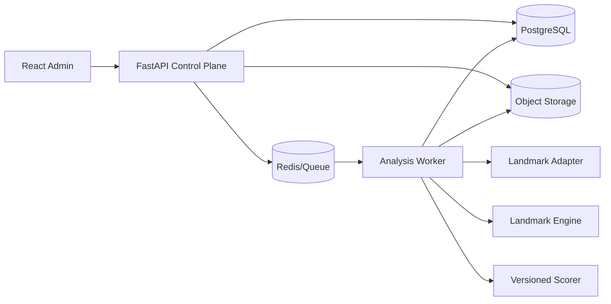

# Architecture

## Style
Modular monolith for control plane + isolated asynchronous analysis worker. This is the 80/20 choice: simple transactional boundaries without coupling CPU-heavy inference to HTTP.

## Module boundaries
- **Control plane:** authentication, jobs, subjects, reviews, model registry, read models.
- **Worker:** media validation, extraction, quality, normalization, scoring and decision persistence.
- **Landmark engine:** framework-independent domain types and deterministic transformations.
- **Adapters:** MediaPipe, SQL, queue, object storage and model runtime.
- **Admin:** typed API client, list/detail/review views; no risk calculations in browser.

## Data ownership
PostgreSQL owns metadata and lifecycle. Object storage owns raw video and feature arrays. Models and calibration artifacts are immutable objects. The browser never receives raw feature arrays by default.

## Reliability
Jobs use an idempotency key `(asset_sha256, claimed_person_id, pipeline_version)`. Each stage persists completion before queue acknowledgement. Retries reuse immutable stage outputs. Poison jobs enter a dead-letter queue.

## Scaling
Scale workers independently by queue depth. Partition object paths by tenant and subject. Move to separate services only when deployment cadence, security boundary or workload proves the need.
